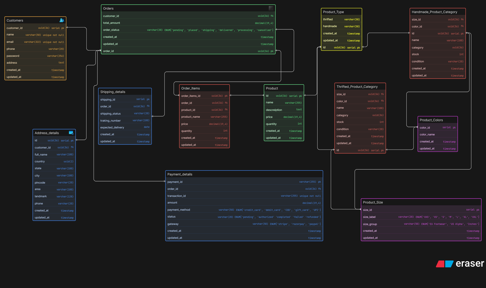

# Instagram Thrift Creator Store (DB Design)

## Problem Statement:

A small creator has started an Instagram-based store where they sell thrifted fashion items and handmade products. At first, the business is very small and receives orders through Instagram DMs and WhatsApp. Over time, the store starts growing and now the owner wants to manage products better, keep track of available stock, handle customer orders properly, and maintain basic information about delivery and payments.

Some products are thrifted and only have one piece available. Some are handmade and can have multiple units. Some items may have size, color or condition details. The business owner may also want to store customer details, order history, payment status and shipping status.
Your task is to design the ER diagram for the database of this business.

This is not just a “shop” problem. You should think carefully about how thrift and handmade products may differ. For example, a thrift item may be unique, while a handmade item may be created in batches or in multiple pieces. A good design should reflect the business properly.

### ER Diagram:

### 1. Customers & Address Management

**Tables**

- `Customers` – Stores user account details.
- `Address_details` – Stores multiple customer addresses.

---

### 2. Product Management

**Tables**

- `Product` – Base product information.
- `Product_Type` – Identifies if product is _Thrifted_ or _Handmade_.
- `Product_Colors` – Color.
- `Product_Size` – Size.
- `Thrifted_Product_Category` – Thrift product attributes.
- `Handmade_Product_Category` – Handmade product attributes.

---

### 3. Orders System

**Tables**

- `Orders` – Main order details & status.
- `Order_Items` – Products inside an order.

---

### 4. Shipping Management

**Table**

- `Shipping_details`
  - Tracks shipping status
  - Stores tracking number & delivery estimate

---

### 5. Payments

**Table**

- `Payment_details`
  - Supports UPI, Card, COD, Gift Card
  - Tracks gateway (Stripe / Razorpay / PayPal)
  - Stores transaction status
