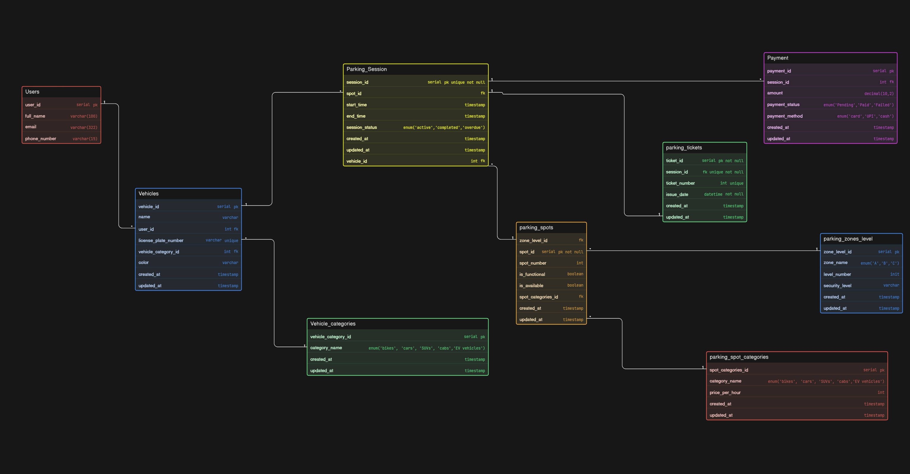

# Comic-Con Parking System

A large convention venue hosts Comic-Con India, where thousands of visitors arrive across multiple days for anime screenings, cosplay competitions, gaming showcases, creator meetups, merchandise zones and panel discussions.

During the event, people arrive using bikes, cars, SUVs, cabs and EV vehicles. The venue has a structured parking facility divided into multiple zones and levels. Some parking areas are reserved for cosplayers with props, exhibitors, creators, VIP guests, staff members and EV charging vehicles.

Whenever a vehicle enters the parking facility, the system generates a parking ticket and assigns a suitable parking spot depending on vehicle type and availability. When the vehicle exits, the system records exit time and calculates the parking fee.

The venue management wants a system that can track:

- vehicles entering the parking facility

- vehicle categories

- parking spot allocation

- reserved parking categories

- entry and exit timestamps

- parking sessions

- payment status

- spot availability across zones and levels

### ER Diagram:

Smart Parking System Database
📌 Project Overview
The Smart Parking Management System is designed to streamline the process of finding, booking, and paying for parking spots. It supports multiple vehicle types, tiered parking zones (levels), and real-time session tracking.

### Database Schema Breakdown

## User & Vehicle Management

- Users: Stores basic profile information including contact details.

- Vehicles: Links users to their registered vehicles. It tracks license plates and colors.

- Vehicle_categories: Defines the type of vehicle (e.g., Bikes, Cars, SUVs, Cabs, EV Vehicles) to ensure they are matched with appropriate parking spots.

## Infrastructure (The Parking Lot)

- Parking_zones_level: Defines the physical layout of the parking facility, including the zone name (A, B, C), level number, and security level.

- Parking_spots: The individual slots where vehicles park. Each spot is linked to a zone and a category.

- Parking_spot_categories: Defines the pricing and type of vehicle a spot can hold.

- Price_per_hour: Variable rates based on the vehicle type (e.g., EV charging spots may cost more than bike spots).

## Core Operations (Sessions & Tickets)

- Parking_Session: The central "event" table. It records when a vehicle enters and leaves a spot and tracks the status (Active, Completed, Overdue).

- Parking_tickets: Generates a unique ticket for every session for physical or digital validation.

## Financials

- Payment: Records transaction details for completed sessions.

- Status: Pending, Paid, Failed.

- Method: Card, UPI, Cash.

### Technical Specifications

## Data Types Used:

- Primary Keys: serial pk (Auto-incrementing integers).

- Timestamps: Used for created_at and updated_at across all tables for auditing.

- Enums: Used for status fields to ensure data integrity (e.g., payment_status, session_status).

- Decimals: decimal(10,2) for financial precision in the amount field.

## Key Relationships:

- One-to-Many: One User can have multiple Vehicles.

- One-to-Many: One Parking Zone can contain many Parking Spots.

- Many-to-One: Many Parking Sessions can be linked to the same Vehicle over time.