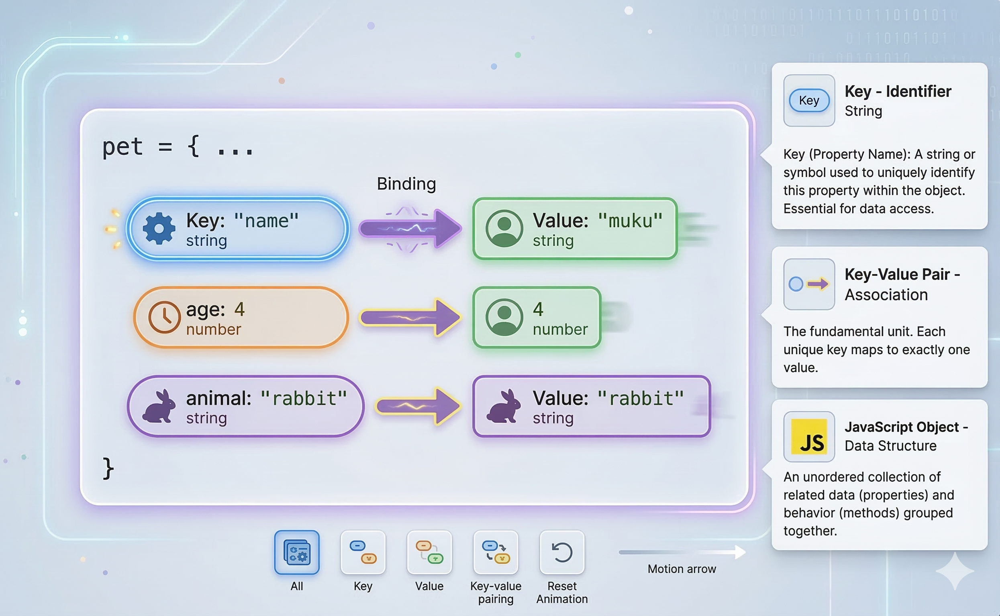

<a href="https://hashnode.com/@dipali20">
 <h1 align="center">Blogs</h1>
</a>

  
  
  

  Showcase of all the learning I did through reading, understanding and writing the blogs for future devs.

[Git for Beginners: Basics and Essential Commands](https://sharmadipali14.hashnode.dev/git-for-beginners-basics-and-essential-commands)

  <a href="https://sharmadipali14.hashnode.dev/why-version-control-exists-the-pendrive-problem">
      

      
    

  </a>

 

[Why Version Control Exists: The Pendrive Problem](https://sharmadipali14.hashnode.dev/why-version-control-exists-the-pendrive-problem)

  <a href="https://sharmadipali14.hashnode.dev/why-version-control-exists-the-pendrive-problem">
      

      
    

  </a>

 

[Inside Git: How It Works and the Role of the .git Folder](https://sharmadipali14.hashnode.dev/inside-git-how-it-works-and-the-role-of-the-git-folder)

  <a href="https://sharmadipali14.hashnode.dev/inside-git-how-it-works-and-the-role-of-the-git-folder">
      

      
    

  </a>

 

[Understanding Network Devices](https://sharmadipali14.hashnode.dev/understanding-network-devices)

  <a href="https://sharmadipali14.hashnode.dev/understanding-network-devices">
      

      
    

  </a>

 

[The Terminal's Hidden Power: Understanding cURL
](https://sharmadipali14.hashnode.dev/the-terminals-hidden-power-understanding-curl)

  <a href="https://sharmadipali14.hashnode.dev/the-terminals-hidden-power-understanding-curl">
      

      
    

  </a>

 

[How DNS Resolution Works](https://sharmadipali14.hashnode.dev/how-dns-resolution-works)

  <a href="https://sharmadipali14.hashnode.dev/how-dns-resolution-works">
      

      
    

  </a>

 

[DNS Record Types Explained](https://sharmadipali14.hashnode.dev/dns-record-types-explained)

  <a href="https://sharmadipali14.hashnode.dev/dns-record-types-explained">
      

      
    

  </a>

 

[Learn Emmet Abbreviation](https://sharmadipali14.hashnode.dev/learn-emmet-abbreviation)

  <a href="https://sharmadipali14.hashnode.dev/learn-emmet-abbreviation">
      

      
    

  </a>

 

[Understanding HTML Tags and Elements](https://sharmadipali14.hashnode.dev/understanding-html-tags-and-elements)
<a href="https://sharmadipali14.hashnode.dev/understanding-html-tags-and-elements">

</a>

 

[CSS Selectors 101: Targeting Elements with Precision](https://sharmadipali14.hashnode.dev/css-selectors-101-targeting-elements-with-precision)
<a href="https://sharmadipali14.hashnode.dev/css-selectors-101-targeting-elements-with-precision">

</a>

 

[TCP vs UDP: When to Use What, and How TCP Relates to HTTP](https://sharmadipali14.hashnode.dev/tcp-vs-udp-when-to-use-what-and-how-tcp-relates-to-http)
<a href="https://sharmadipali14.hashnode.dev/tcp-vs-udp-when-to-use-what-and-how-tcp-relates-to-http">

</a>

 

[TCP Working: 3-Way Handshake & Reliable Communication](https://sharmadipali14.hashnode.dev/tcp-working-3-way-handshake-and-reliable-communication)
<a href="https://sharmadipali14.hashnode.dev/tcp-working-3-way-handshake-and-reliable-communication">

</a>

 

[How a Browser Works: A Beginner-Friendly Guide to Browser Internals](https://sharmadipali14.hashnode.dev/how-a-browser-works-a-beginner-friendly-guide-to-browser-internals)
<a href="https://sharmadipali14.hashnode.dev/how-a-browser-works-a-beginner-friendly-guide-to-browser-internals">

</a>

 

[JavaScript Beginner Friendly](https://sharmadipali14.hashnode.dev/javascript-beginner-friendly-part-1)
<a href="https://sharmadipali14.hashnode.dev/javascript-beginner-friendly-part-1">

</a>

 

[Understanding Variables and Data Types in JavaScript](https://sharmadipali14.hashnode.dev/understanding-variables-and-data-types-in-javascript)
<a href="https://sharmadipali14.hashnode.dev/understanding-variables-and-data-types-in-javascript">

</a>

 

[Understanding Promise in JavaScript](https://sharmadipali14.hashnode.dev/understandingpromise-in-javascript)
<a href="https://sharmadipali14.hashnode.dev/understandingpromise-in-javascript">

</a>

 

[JavaScript Operators: The Basics You Need to Know](https://sharmadipali14.hashnode.dev/javascript-operators)
<a href="https://sharmadipali14.hashnode.dev/javascript-operators">

</a>

 

[Control Flow in JavaScript: If, Else, and Switch Explained](https://sharmadipali14.hashnode.dev/control-flow-in-javascript-if-else-and-switch-explained)
<a href="https://sharmadipali14.hashnode.dev/control-flow-in-javascript-if-else-and-switch-explained">

</a>

 

[Function Declaration vs Function Expression: What’s the Difference?](https://sharmadipali14.hashnode.dev/function-declaration-vs-function-expression-what-s-the-difference)
<a href="https://sharmadipali14.hashnode.dev/function-declaration-vs-function-expression-what-s-the-difference">

</a>

 

[Arrow Functions in JavaScript: A Simpler Way to Write Functions](https://sharmadipali14.hashnode.dev/arrow-functions-in-javascript-a-simpler-way-to-write-functions)
<a href="https://sharmadipali14.hashnode.dev/arrow-functions-in-javascript-a-simpler-way-to-write-functions">

</a>

 

[JavaScript Arrays 101](https://sharmadipali14.hashnode.dev/javascript-arrays-101)
<a href="https://sharmadipali14.hashnode.dev/javascript-arrays-101">

</a>

 

[Array Methods You Must Know](https://sharmadipali14.hashnode.dev/array-methods-you-must-know)
<a href="https://sharmadipali14.hashnode.dev/array-methods-you-must-know">

</a>

 

[Understanding Objects in JavaScript](https://sharmadipali14.hashnode.dev/understanding-objects-in-javascript)
<a href="https://sharmadipali14.hashnode.dev/understanding-objects-in-javascript">

</a>

 

[The Magic of this, call(), apply(), and bind() in JavaScript](https://sharmadipali14.hashnode.dev/the-magic-of-this-call-apply-and-bind-in-javascript)
<a href="https://sharmadipali14.hashnode.dev/the-magic-of-this-call-apply-and-bind-in-javascript">

</a>

 

[Understanding Object-Oriented Programming in JavaScript](https://sharmadipali14.hashnode.dev/understanding-object-oriented-programming-in-javascript)
<a href="https://sharmadipali14.hashnode.dev/understanding-object-oriented-programming-in-javascript">

</a>

 

[Deep dive into Node.JS Architecture](https://sharmadipali14.hashnode.dev/deep-dive-into-node-js-architecture)
<a href="https://sharmadipali14.hashnode.dev/deep-dive-into-node-js-architecture">

</a>

 
